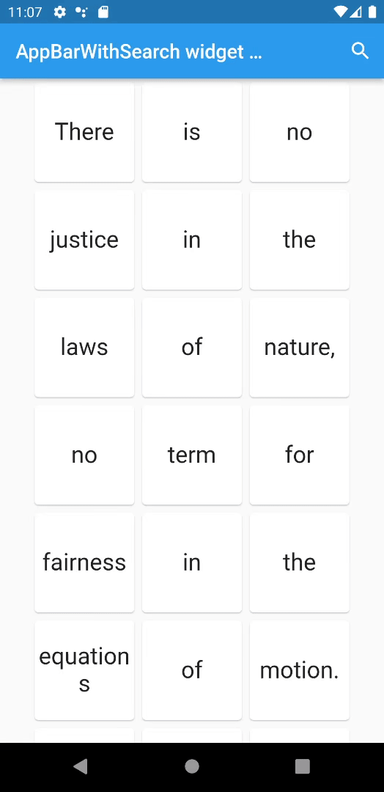

# AppBar with search switch

An AppBar with switch into search field.

## Usage

A simple usage example:

```dart
class _MyHomePageState extends StatelessWidget {
  const SettingsScreen({Key? key}) : super(key: key);

  @override
  Widget build(BuildContext context) {
     return Scaffold(
      appBar: AppBarWithSearchSwitch(
        onChanged: (text) {
          setState(() => searchText = text);
        },
        appBarBuilder: (context) => AppBar(
          title: Text(widget.title),
          actions: [
            IconButton(
              icon: Icon(AppBarWithSearchSwitch.of(context)?.text != ''
                  ? Icons.search_off
                  : Icons.search),
              tooltip:
                  'Last input text: ${AppBarWithSearchSwitch.of(context)?.text}',
              color: AppBarWithSearchSwitch.of(context)?.text != ''
                  ? Colors.tealAccent
                  : null,
              onPressed: () {
                AppBarWithSearchSwitch.of(context)?.triggerSearch(context);
                print(AppBarWithSearchSwitch.of(context)?.isActive.value);
              },
            ),
          ],
        ),
      ),
      body: Container(),
    }
  }
}
```

## Screenshot

